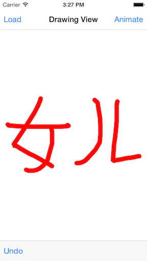
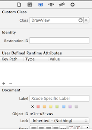
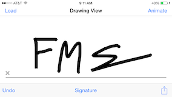
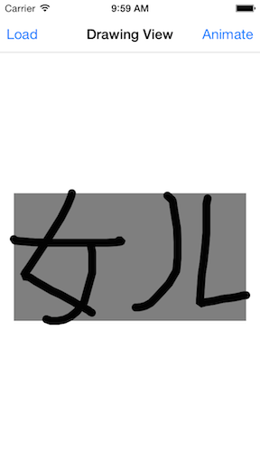

# DrawView
Subclass of UIView that supports drawing.



# Basic Usage
Using CocoaPods

	pod "DrawView"

In the storyboard under the views Identity Inspector set the view class to ```DrawView```. 



In the implementation file you can setup the drawing view. 

	drawingView.strokeColor = [UIColor blackColor];
	drawingView.strokeWidth = 25.0f;
	
Since DrawView is a subclass of UIView, to change the background just change the ```backgroundColor``` property.

# Usage
## Drawing Existing Paths
You can draw either a existing ```UIBezierPath``` or ```CGPathRef``` by calling either of the following methods.

	- (void)drawBezier:(UIBezierPath *)path;
	- (void)drawPath:(CGPathRef)path;

## Animating Path
To animate the current path in the draw view call
	
	- (void)animatePath;

## Undo Support
To support undo add a button with a target to the ```DrawView``` instance, and set the action to ```undoDrawing:```. See example for more details.

## Signature Mode
To enable signature mode call ```setMode:``` and pass in the ```SignatureMode``` mode type. This will give you a simple signature UI for the user to use while signing on the device.



## Reading Drawing View
There are two ways to read what is currently in the drawing view. Either call ```imageRepresentation``` which will return a UIImage that can be later used in a email or to save to the users Camera Roll. Or call ```bezierPathRepresentation``` which returns a single bezier path that can be archived and restored within your app. See the example project for more information.

			// How to read the drawing view into a image and save to the camera roll.
            UIImage *drawingImage = [drawingView imageRepresentation];
            ALAssetsLibrary *library = [[ALAssetsLibrary alloc] init];
            [library writeImageToSavedPhotosAlbum:drawingImage.CGImage orientation:ALAssetOrientationUp completionBlock:^(NSURL *assetURL, NSError *error) {
                NSLog(@"%@",assetURL);
                NSLog(@"%@",error);
            }];

## Debugging Drawing
To debug the path set ```debugBox``` to ```true```. This will add a grey box around the bounds of the current path.

